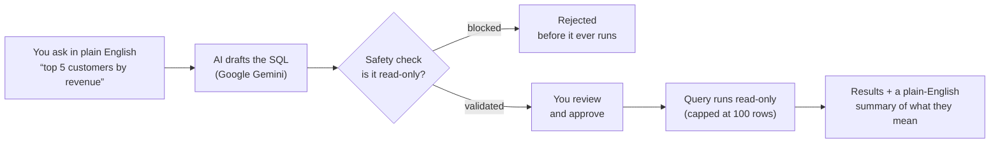

# Natural QL

**Talk to your database in plain English. Natural QL writes the SQL, shows it to you, and only runs it after you say yes - and it can never change your data.**

Natural QL is an AI database agent. Connect a PostgreSQL, MySQL, or SQLite database, ask a question like *"who were my top 5 customers last month?"*, and Google Gemini drafts the SQL for you. You review it, approve it, and the query runs **read-only**. Results come back as a table plus a plain-English summary of what they mean.

Think of it as two helpers working together: a **translator** that turns your English into SQL, and a **careful assistant** that refuses to run anything risky and always asks for your OK first.

## Demo

<p align="center">
  
</p>

**[Watch the full video](https://youtu.be/FIOenBWCaoA)** to see Natural QL in action.

## How it works



Every query passes through a safety gate **twice** (once when drafted, once right before it runs), so a query is never trusted just because the AI wrote it. More on that below.

## Why it's safe

Giving an AI access to your database sounds scary. Natural QL is built so it cannot go wrong:

- **Read-only, always.** The validator rejects anything that isn't a plain `SELECT`. No `INSERT`, `UPDATE`, `DELETE`, `DROP`, or schema changes ever reach your database.
- **You are the approve button.** Nothing runs until you read the SQL and click **Approve & Run**. You can even edit the query first.
- **Real parsing, not guesswork.** For PostgreSQL it parses the query into an abstract syntax tree (the same structure a database itself builds) to catch sneaky cases, instead of just scanning for bad words.
- **Your credentials stay with you.** Connection details live in your browser session and are sent with each request. The server keeps no database connections or passwords around.
- **Results are capped** at 100 rows so a careless `SELECT *` can't flood your screen.

## Features

- **Multi-database support**: PostgreSQL, MySQL, and SQLite, out of the box.
- **AI SQL generation**: plain English in, dialect-correct SQL out, powered by Google Gemini.
- **Safety guardrails**: read-only validation that rejects writes, DDL, and multi-statement tricks, with an automatic row limit.
- **Human-in-the-loop approval**: review (and edit) every query before it runs.
- **AI result explanations**: a summary and key takeaways in everyday language, not just a wall of rows.

## Tech stack

Next.js 16 (App Router) · React 19 · TypeScript · Tailwind CSS v4 · Zod · Google Gemini (`@google/genai`) · `pg` / `mysql2` / `better-sqlite3` · `pgsql-parser` · Vitest.

## Quick start

1. **Install dependencies** (uses pnpm):
   ```bash
   pnpm install
   ```

2. **Add your Gemini API key.** Create a `.env` file in the project root:
   ```bash
   GEMINI_API_KEY=your_gemini_api_key
   # Optional - defaults to gemini-2.5-flash
   # GEMINI_MODEL=gemini-2.5-flash
   ```
   You can grab a free key from [Google AI Studio](https://aistudio.google.com/apikey).

3. **Run the dev server:**
   ```bash
   pnpm dev
   ```
   Open `http://localhost:3000` for the landing page, or go straight to `http://localhost:3000/app` to start querying.

## Running tests

```bash
pnpm test        # Vitest - covers the read-only SQL guardrails
npx tsc --noEmit # TypeScript type check
```

## Docs

- **[User Guide](docs/user-guide.md)**: connect a database, ask questions, review and run queries. Start here if you just want to use it.
- **[Developer Docs](docs/developer-docs.md)**: architecture, diagrams, API routes, the safety model, and where everything lives. Start here if you want to build on it.

## License

MIT © 2026 Harshit Verma. See [LICENSE](LICENSE) for details.
