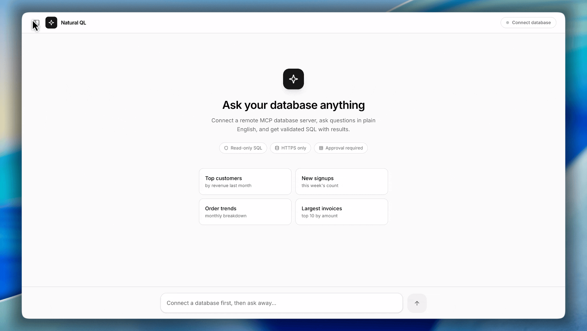

# Natural QL

Natural QL is an AI database agent. It allows users to connect any supported database (PostgreSQL, MySQL, or SQLite), ask questions in plain English, and receive SQL queries drafted by Google Gemini. After reviewing and approving the generated SQL, the query runs safely (read-only) and the results are presented alongside an AI-generated natural language summary and insights.

# Project Demo
<p align="center">
  
</p>

**[Watch Full Video](https://youtu.be/FIOenBWCaoA)** See NaturalQL in action

## Features

- **Multi-Database Support**: Connect directly to PostgreSQL, MySQL, or SQLite databases.
- **AI SQL Generation**: Converts plain English questions into database-specific SQL queries using Google Gemini.
- **Safety & Guardrails**: 
  - Validates SQL to ensure it is read-only (rejects write statements, DDL, multiple statements).
  - Appends query limits to prevent overwhelming the client.
- **User-in-the-Loop Approval**: Generated SQL must be reviewed and explicitly approved before execution.
- **AI Result Explanations**: Explains the query results in simple language with key insights.

## Docs

- [User Guide](docs/user-guide.md) — How to connect databases, run queries, and review results.
- [Developer Docs](docs/developer-docs.md) — Architecture, components, API routes, and testing.

## Quick Start

1. **Install Dependencies**:
   ```bash
   pnpm install
   ```

2. **Configure Environment Variables**:
   Create a `.env` file in the project root:
   ```bash
   GEMINI_API_KEY=your_gemini_api_key
   # Optionally override the model (defaults to gemini-2.5-flash)
   # GEMINI_MODEL=gemini-2.5-flash
   ```

3. **Start the Dev Server**:
   ```bash
   pnpm dev
   ```
   Open `http://localhost:3000` in your browser.

## Running Tests

We use Vitest for verifying SQL validation logic:
```bash
pnpm test
```

For TypeScript type checking:
```bash
npx tsc --noEmit
```

---

## License

MIT © 2026 Harshit Verma. See [LICENSE](LICENSE) for details.
