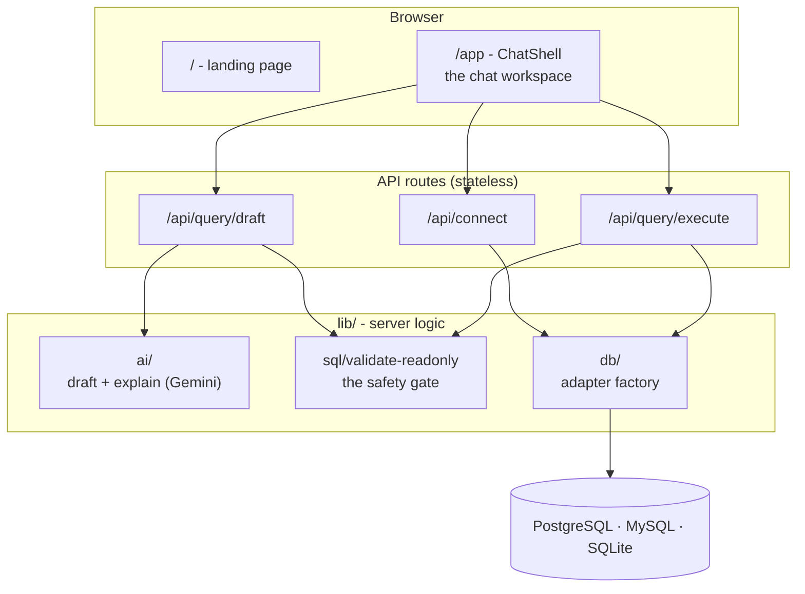
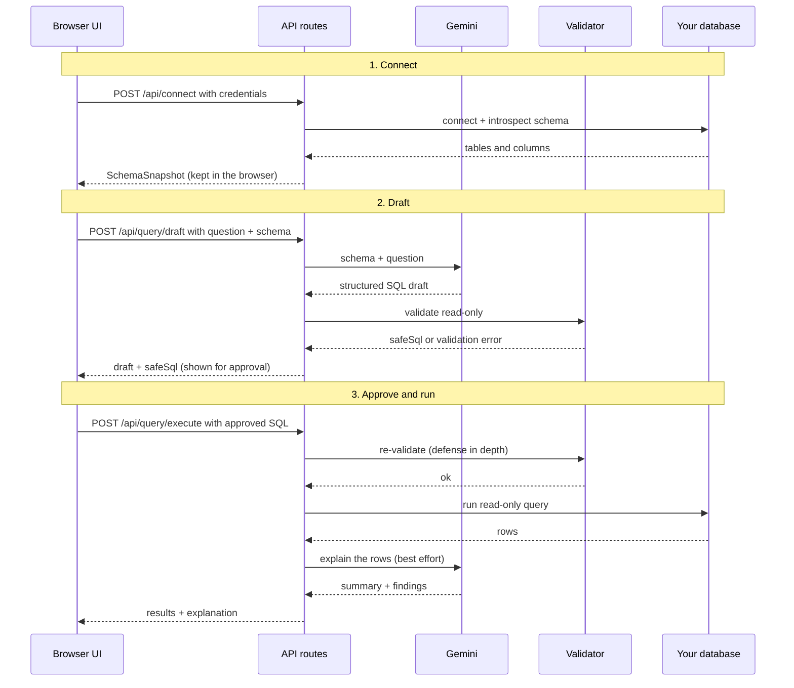
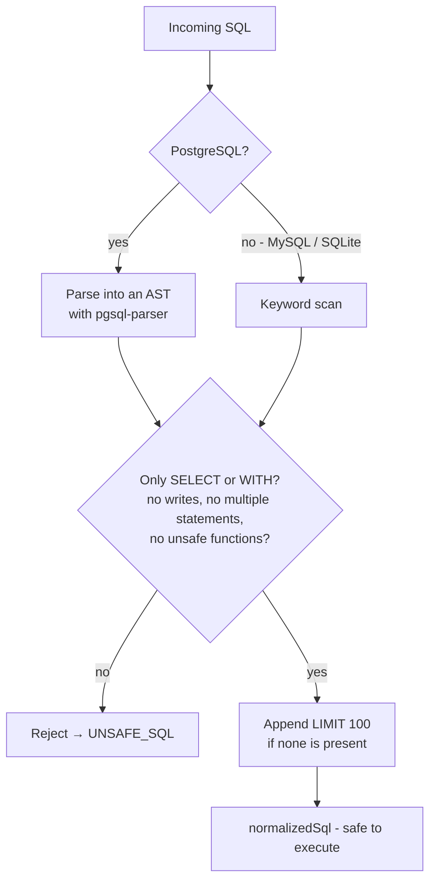

# Natural QL Developer Docs

Natural QL is a single Next.js 16 app (App Router) that turns plain-English questions into safe, read-only SQL. This doc explains how the pieces fit together so you can find your way around and build on it.

If you only remember one thing: **the AI is never trusted on its own.** Every query it writes is parsed and validated before it can run, and the user has to approve it. The whole architecture exists to enforce that.

## The big picture

There are two surfaces and three jobs the backend does. The browser holds your database credentials and talks to three small, stateless API routes:



**Stateless on purpose.** The server never holds open database connections or caches credentials. Each request carries its own connection config, opens a connection, does its job, and closes it. That keeps the app serverless-friendly and means there's no shared state to leak between users.

## The request lifecycle

One full round trip, from connecting to reading results:



Notice the validator runs in **both** step 2 and step 3. The draft is validated before you ever see it, and the SQL is validated *again* right before execution because you might have edited it. Never assume an incoming SQL string is safe just because the model produced it.

## API routes

All three live under `app/api/` and return the same envelope: `ApiResponse<T>`, a discriminated union of `{ ok: true, ... }` or `{ ok: false, code, message }`. Error responses are written with `satisfies ApiResponse<never>` so the compiler keeps them honest.

| Route | Does | Key error codes |
|-------|------|-----------------|
| `POST /api/connect` | Opens an adapter, introspects the schema, returns a `SchemaSnapshot` (then disconnects) | `CONNECTION_FAILED`, `INTROSPECTION_FAILED` |
| `POST /api/query/draft` | Sends schema + question to Gemini, validates the draft, returns `{ draft, safeSql, validationError }` | `AI_NOT_CONFIGURED`, `AI_DRAFT_FAILED`, `UNSAFE_SQL` |
| `POST /api/query/execute` | Re-validates the SQL, runs it read-only, then explains the rows | `UNSAFE_SQL`, `QUERY_FAILED` |

Every route starts by `safeParse`-ing its body against a Zod schema (`ConnectRequestSchema`, `DraftRequestSchema`, `ExecuteRequestSchema`) and returns `INVALID_INPUT` on a mismatch.

## The safety gate

`lib/sql/validate-readonly.ts` is the security core. It's the one file with a test suite, and the one to be most careful editing.



- **PostgreSQL** gets real parsing. `pgsql-parser` turns the query into an abstract syntax tree (the structured form a database builds internally), so the validator inspects what the query actually *is*, not how it's spelled. It rejects multiple statements, anything that isn't a `SELECT`, `SELECT INTO`, transaction control, and unsafe system functions like `pg_sleep` or backend-signaling calls.
- **MySQL and SQLite** use keyword-based validation that rejects write/DDL keywords (`INSERT`, `UPDATE`, `DELETE`, `DROP`, `ALTER`, `CREATE`, `REPLACE`, `RENAME`, `TRUNCATE`, `GRANT`, and friends).
- Either way, a `LIMIT 100` is appended when the query has no limit, so results stay bounded.

A successful validation returns `normalizedSql` (the cleaned, limited query) and the list of tables it touches.

## How the AI is used

Two thin wrappers around Google Gemini (`@google/genai`), both asking for **structured output** that matches a Zod schema instead of free text:

- `lib/ai/draft-query.ts` builds a system prompt containing your schema and the dialect rules ("only SELECT", "reference only these tables", etc.), then returns a `QueryDraft`:

  ```ts
  type QueryDraft = {
    needsClarification: boolean;
    clarifyingQuestion: string | null;
    sql: string | null;
    tablesReferenced: string[];
    assumptions: string[];
    caveats: string[];
    confidence: number;       // 0..1
    explanationPlan: string;
  };
  ```
  If the question is ambiguous or impossible against the schema, the model sets `needsClarification` instead of guessing.

- `lib/ai/explain-results.ts` takes the rows and returns a `ResultExplanation` (`summary`, `findings`, `caveats`). This call is **best effort**: if it fails, `/api/query/execute` falls back to a default summary and still returns your data. The explanation never blocks your results.

## Database adapters

Every database speaks through one interface, so the rest of the app doesn't care which engine you connected to.

```ts
interface DbAdapter {
  connect(): Promise<void>;
  introspect(): Promise<SchemaSnapshot>;   // tables + columns
  execute(sql: string): Promise<QueryResult>;
  disconnect(): Promise<void>;
}
```

`createAdapter(connection)` in `lib/db/index.ts` is a factory that returns the right implementation based on `connection.type`:

- `lib/db/postgres.ts` uses `pg.Client`
- `lib/db/mysql.ts` uses `mysql2/promise`
- `lib/db/sqlite.ts` uses `better-sqlite3` opened in read-only mode

**To add a database:** implement `DbAdapter` for the new driver, add its type to `DbTypeSchema` / `DbConnectionSchema` in `lib/types/query.ts`, wire it into the `createAdapter` switch, and teach `validate-readonly.ts` how to check its dialect.

## Where things live

| Path | What's there |
|------|--------------|
| `app/page.tsx`, `components/landing/` | The marketing landing page at `/` |
| `app/app/page.tsx`, `components/chat/` | The chat workspace at `/app` |
| `components/chat/chat-shell.tsx` | The orchestrator: holds connection + schema in refs, drives ask → draft → approve → execute |
| `components/chat/sql-card.tsx` | The SQL review card (confidence, validation, edit, approve) |
| `components/chat/results-card.tsx` | Explanation + collapsible results table |
| `lib/types/query.ts` | Zod schemas + types for connections, drafts, results, and the API envelope |
| `lib/types/chat.ts` | Chat message types (a discriminated union) |
| `lib/hooks/use-chat-history.ts` | Multi-conversation history, persisted to `localStorage` (client only) |
| `lib/utils.ts` | `cn()` (a plain class-name joiner) and `postJson()` |

## Conventions worth knowing

- **Zod everywhere.** API bodies, query types, and chat messages are all Zod schemas. Parse at the boundary with `safeParse`.
- **Styling** is Tailwind v4 (CSS-first). Design tokens are oklch CSS variables in `app/globals.css` exposed through `@theme inline`; components use Tailwind utility classes directly.
- **Icons** are hand-written inline SVGs in `components/chat/icons.tsx`. There's no icon or component library.
- **`cn()`** is a simple `filter(Boolean).join(" ")`, not clsx or twMerge.
- **Path alias** `@/*` maps to the project root.

## Environment

```bash
GEMINI_API_KEY=your-api-key-here   # required for drafting and explaining
GEMINI_MODEL=gemini-2.5-flash      # optional, this is the default
```

## Gotchas

- `pgsql-parser`, `libpg-query`, `better-sqlite3`, `mysql2`, and `pg` are native packages. They must stay in `next.config.ts` → `serverExternalPackages` or the build breaks.
- This is **Next.js 16** with breaking changes from older versions. When unsure about an App Router API, check `node_modules/next/dist/docs/` rather than relying on memory.
- `pnpm-workspace.yaml` exists but this is **not** a monorepo - it only declares `ignoredBuiltDependencies`.

## Testing

```bash
pnpm test                                      # run the whole suite once
pnpm vitest run lib/sql/validate-readonly.test.ts   # just the guardrail tests
npx tsc --noEmit                               # type check (no dedicated script)
```

Vitest runs in a node environment against `**/*.test.ts`. Coverage today is focused on the read-only SQL validator across all three dialects. If you change anything in the safety gate, the validator tests are your first line of defense - keep them green and add cases.
