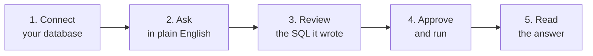

# Natural QL User Guide

Welcome! This guide walks you through using Natural QL from start to finish. No SQL knowledge required! that's the whole point. You ask questions in plain English, and Natural QL handles the database part.

Here's the journey you'll take:



## Before you start

You need just one thing: **a database you can connect to** (PostgreSQL, MySQL, or SQLite) and its connection details. Natural QL only ever reads, so read access is plenty.

To open the workspace, click **Open app** (or **Get started**) from the home page. That's the chat screen where everything happens. The AI that writes and explains your SQL is already set up for you, so there's nothing to install or configure.

> **Running your own copy instead?** Self-hosting takes a free Google Gemini API key and a couple of commands. It's all in [Running it locally](#running-it-locally) at the end of this guide.

## Step 1: Connect a database

Click **Connect Database** in the top-right of the header. A dialog opens with three tabs:

| Database | What to enter |
|----------|---------------|
| **PostgreSQL** | Host, port (default `5432`), user, password, and database name |
| **MySQL** | Host, port (default `3306`), user, password, and database name |
| **SQLite** | The full path to your `.db` file on disk |

Click **Connect**. Natural QL takes a quick look at your database to learn its tables and columns (this is called *introspection*), then keeps that map in your browser for the session. Your password is never stored on a server.

> **Tip:** Don't have a database handy? A local SQLite file is the fastest way to try it. Point the SQLite tab at any `.db` file.

## Step 2: Ask a question

Type a question in the box at the bottom, the way you'd ask a coworker:

- *"Show me the top 5 customers by revenue"*
- *"How many users signed up in the last month?"*
- *"What's the average price of products?"*

In a hurry? The welcome screen has **starter query** cards you can click to fill in a question for you.

## Step 3: Review the SQL

Natural QL doesn't just run off and query your data. It drafts the SQL and shows it to you in a **SQL card** so you stay in control:

- **Confidence score**: how sure the AI is that its query matches your question.
- **The SQL itself**: the exact query it wrote, in your database's dialect.
- **A "Validated" badge**: green means the query passed the read-only safety checks. (If something looks unsafe, you'll see why instead.)
- **Details**: expand this to see which tables it used, any assumptions it made, and caveats worth knowing.

Not quite right? You can **edit the SQL** directly in the card before running it.

## Step 4: Approve and run

When you're happy, click **Approve & Run**. This is the moment you're in charge of: nothing touches your database until you press it. The query runs **read-only**, so it can only ever read data, never change it.

## Step 5: Read the answer

You get back a **results card** with two parts:

1. **A plain-English explanation**: a short summary of what the data shows, the key takeaways, and any caveats. This is the part that turns rows into an actual answer.
2. **The data table**: the raw results, collapsible, capped at 100 rows so big queries stay manageable.

That's it. Ask a follow-up question any time, or start a **New Chat** from the sidebar to begin fresh. Your past conversations are saved in your browser so you can jump back to them later.

## A few good-to-knows

- **It only reads.** Even if you ask it to delete or change something, the safety layer blocks it. Natural QL is a read-only tool by design.
- **100-row cap.** Results are limited to 100 rows. Ask a more specific question (or add your own `LIMIT`) if you need a narrower slice.
- **Nothing leaves your browser** except the query and schema needed to answer your question. Credentials stay local to your session.

## Running it locally

Most people can use the hosted app and skip this section. But if you'd rather run your own copy, here's the whole setup.

You'll need [Node.js](https://nodejs.org) and [pnpm](https://pnpm.io) installed, plus a free **Google Gemini API key** (it's what writes the SQL and explains your results). Grab a key from [Google AI Studio](https://aistudio.google.com/apikey).

1. **Install dependencies:**
   ```bash
   pnpm install
   ```
2. **Add your key** to a `.env` file in the project root:
   ```bash
   GEMINI_API_KEY=your_gemini_api_key_here
   # Optional, defaults to gemini-2.5-flash
   # GEMINI_MODEL=gemini-2.5-flash
   ```
3. **Start the app:**
   ```bash
   pnpm dev
   ```
   Then open `http://localhost:3000` in your browser and click **Open app** to start querying.

For architecture, the API routes, and how everything fits together, see the [Developer Docs](developer-docs.md).
